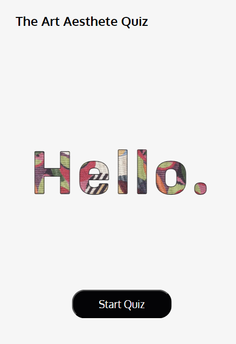
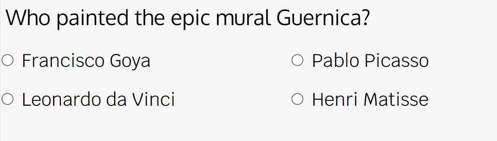
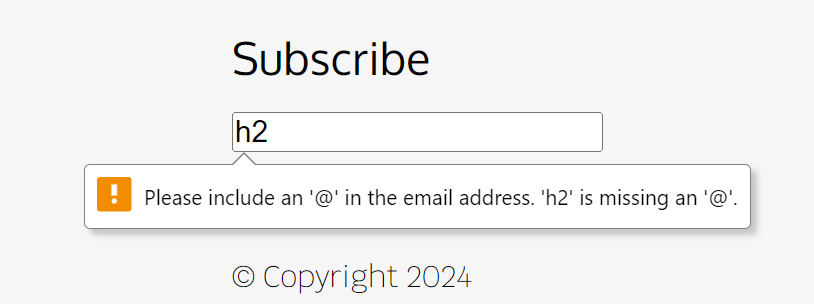

# The Art Aesthete Quiz

[Am I responsive - Art Quiz](docs/am-i-responsive.png "Am I responsive")

# Project Overview

Welcome,

This is The Art Aesthete Quiz website, an interactive quiz website for art enthusiasts. It is Rachel Luke's submission for Code Institue's Interactive Front End Design module.

The following are high-level details of this project:

- The main technologies used are HTML, CSS and JavaScript.
- The project demonstrates interactive front end web design.
- A top navigation bar and footer is established for structured layout.
- Git & GitHub are used for version control.
- Any external code sources used in the project are clearly identified in the code itself and in this README.md file
- The final version has been deployed via GitHub Pages. 

The last update to this file was: **June 12th, 2024**

# Table of Contents

- [The Art Aesthete Quiz](#the-art-aesthete-quiz)
- [Project Overview](#project-overview)
- [Table of Contents](#table-of-contents)
- [UX](#ux)
  - [User Goals](#user-goals)
  - [User Stories](#user-stories)
  - [Site Owners Goals](#site-owners-goals)
    - [Requirements](#requirements)
    - [Expectations](#expectations)
- [UI / Design Choices](#ui-design-choices)
  - [Moodboard](#moodboard)
  - [Fonts](#fonts)
  - [Icons](#icons)
  - [Colours](#colours)
  - [Media Queries](#media-queries)
  - [Wireframes](#wireframes)
- [Features](#features)
  - [Existing Features](#existing-features)
    - [Home Section](#home-section)
    - [Quiz Mode Section](#quiz-mode-section)
    - [Quiz Game Section](#quiz-game-section)
    - [Quiz Result Section](#quiz-result-section)
    - [Footer](#footer)
  - [Future actions - Features to be Implemented](#future-actions)
- [Technologies used](#technologies-used)
  - [Languages](#languages)
  - [IDE](#ide)
  - [Libraries & Framework](#libraries-framework)
  - [Tools](#tools)
- [Validating](#validating)
  - [HTML Validation](#html-validation)
  - [CSS Validation](#css-validation)
  - [JS Validation](#js-validation)
- [Testing](#testing)
  - [Testing User Stories](#testing-user-stories)
  - [Debugging](#debugging)
  - [Unfixed Bugs](#unfixed-bugs)
- [Deployment](#deployment)
- [Credits](#credits)

# UX

## User Goals

1. Visually appealing, including images.
2. Easily navigated around.
3. Accessible information to understand how to play the quiz.
4. Exude an artistic aesthetic to fit the theme.
5. Available contact information.

## User Stories

1. As a user, I want to find this art quiz website aesthetic and appealing. 
2. As a user, I want to be able to choose the difficulty of the quiz.
3. As a user, I want to be able to easily navigate through the website.
4. As a user, I want to be able to know if my chosen quiz answers are correct.
5. As a user, I want to know what my final quiz score is.

## Site Owners Goals

1. Promote art.
2. Increase the number of online foot traffic.
3. Increase rankings on search engines.

### Requirements

1. Easy to navigate on various screen sizes.
2. Clear information on what the website offers (a quiz game).
3. Functioning quiz game for users to interact with and delve into their hobby.
4. Simple methods of contacting the website owners.
5. Visually inviting so users engage longer on the website.
  
### Expectations

1. I expect to know if a quiz answer has been submitted properly and if it is correct.
2. I expect all links to social media sites to be opened in a new tab.
3. I expect all navigation links to work correctly.
4. I expect screen size not to affect the quality of the website.
5. I expect all information to be correct and accurate.

\
&nbsp;
[Back to Top](#table-of-contents)
\
&nbsp;

# UI / Design Choices

## Moodboard

One of the first milestones of this project was to create a moodboard to help envision the overall house style of the webiite and ensure that all of the sections and elements are cohesive. The software I used to create the moodboard for this website is [Mila Note](https://milanote.com/ "Mila Note").
Below, is the moodboard:

## Fonts

In order to move away from the basic fonts available, I have used
[Google Fonts](https://fonts.google.com/ "Google Fonts") to find a text that best suits the feel of the website. For the launch page title "Hello.", which is the very first element the users' attention is drawn to, I have chosen [Sofia Sans](https://fonts.google.com/specimen/Sofia+Sans "Sofia Sans font"). The background-fill of the text is a busy, vibrant image and this font was clear and easy to read. The main text I have chosen [Krub](https://fonts.google.com/specimen/krub "Krub font") as I feel it suits the contemporary art aesthetic and it is clear to read. To make the headers stand out, I decided to use [Oxygen](https://fonts.google.com/specimen/Oxygen?query=oxygen "Oxygen font"). This font is complimentary to the Krub font, and will help be distinctive as the main navigation link/ logo in the header. An additional font [Petrona](https://fonts.google.com/?query=petrona "Petrona font") is used to contrast against the modern, sans serif text. 

Additional Notes:

- I have intentionally imported the fonts in the css file and not index.html as it saved some space in the html file and as this is a static website, the slightly longer loading time is not critical.
  
- Backup fonts (sans-serif) have been put in place as a safety net, in case the custom fonts used are not available.

- There is a 'double reset' in the css file. It simplifies calculate rem unit as I no longer need to think in scale factor of 1.6 but 10 instead.

## Icons

I have incorporated icons for my website from the [Font Awesome library](https://fontawesome.com/ "Font Awesome"). These icons are used as the social media links in the footer and also in the subscribed.html file. All icons used are styled within the overall website theme.

During testing, the console indicated that an icon from Favicon was required as the 'logo' symbol for the browser tab. As a fitting icon, I downloaded and included the paintbrush icon from [Favicon](https://favicon.io/ "Favicon") at the top of index.html 

## Colours

The colour scheme of the website is inspired by the moodboard (previously depicted). I have used [Coolers](https://coolors.co/ "coolers") to retrieve the desired colour codes and generate the colour palette.

Below, is the color palette:

## Media Queries

As a starting point, I have designed this website with a mobile first mindset using the iPhone 5/SE (320px) as the smallest screen size for styling to look good on. Then I created 3 additional media queries for largers devices listed below.

| Screen Size |  Breakpoint |
| ----------- | ----------- | 
| mobile      |  <320px     |
| tablet      |  => 768px   |
| laptop      |  => 1920px  |
| desktop     |  => 2560px  |

\
&nbsp;
[Back to Top](#table-of-contents)
\
&nbsp;

## Wireframes

I have used [Balsamiq](https://balsamiq.com/wireframes/ "Balsamiq") to develop my wireframes for my website. I initially created the mobile version and then the wireframes and then scaled it up for desktop. The website is a single page that is scrollable and displays/hides sections with logic in lieu of having multiple HTML pages to avoid inconvenient reloading of entire website.

The wireframes are below:

[Landing Page - Desktop Wireframe](docs/wireframes/launch-view-desktop.png "home desktop wireframe")

[Landing Page - Phone Wireframe](docs/wireframes/launch-view-mobile.png "home phone wireframe")

[Quiz Mode Section - Desktop Wireframe](docs/wireframes/quiz-mode-view-desktop.png "mode desktop wireframe")

[Quiz Mode Section - Phone Wireframe](docs/wireframes/quiz-mode-view-mobile.png "mode phone wireframe")

[Quiz Game Section - Desktop Wireframe](docs/wireframes/quiz-view-desktop.png "quiz desktop wireframe")

[Quiz Game Section - Phone Wireframe](docs/wireframes/quiz-view-mobile.png "quiz phone wireframe")

[Help Section - Desktop Wireframe](docs/wireframes/help-view-desktop.png "help desktop wireframe")

[Help Section - Phone Wireframe](docs/wireframes/help-view-mobile.png "help phone wireframe")

[Result Section - Desktop Wireframe](docs/wireframes/result-view-desktop.png "result desktop wireframe")

[Result Section - Phone Wireframe](docs/wireframes/result-view-mobile.png "result phone wireframe")

[Footer - Desktop Wireframe](docs/wireframes/footer-desktop.png "footer desktop wireframe")

[Footer - Phone Wireframe](docs/wireframes/footer-mobile.png "footer phone wireframe")

\
&nbsp;
[Back to Top](#table-of-contents)
\
&nbsp;

# Features 

## Existing Features 

### Home Section

- Header
  - The header has the name of the website's organisation and also acts as a navigation point for the users to return back to the home page when they progress through the quiz.
   \
    &nbsp;

    

    \
    &nbsp;

  - The title has a hover effect of changing colours from Midnight to Cornblue (fitting the colour scheme), to improve UI.
  \
    &nbsp;

    

    \
    &nbsp;

  - As sections will be hidden/ displayed and the 'single-page' website is relatively short in length, the header position does not have to be fixed.
  \
    &nbsp;

- Title
  - The title 'Hello.' has a text-fill background of a vibrant inage to contrast against the minimalist background. 
  \
    &nbsp;

    

    \
    &nbsp;

- Start Button
  - The start button being featured at the very start indicates to the user the flow of the website.
  \
    &nbsp;

    

    \
    &nbsp;

  - When hovered, the button has a goldenfizz yellow background and midnight black text for improved UI.
  \
    &nbsp;

    

    \
    &nbsp;

### Quiz Mode Section

- Horizontal Divider
  - Throughout the website, including for this section, Horizontal Dividers are used to separate sections. They are set to be thin and subtle to be helpful but still aesthetic.
   \
    &nbsp;

    

    \
    &nbsp;

- Responsive Layout
  - Depending on the size of the screen, the arrangement of the modes will alter. 
   \
    &nbsp;

    

    \
    &nbsp;

    

    \
    &nbsp;

- Navigation
  - Each of the three mode images navigate to the subsequent Quiz Game section, with the respective mode selected. To help indicate to the user that they have to click the image, a hover effect of reduced opacity by 50% has been added to the images.
    \
      &nbsp;

      

      \
      &nbsp;

[Back to Top](#table-of-contents)
\
&nbsp;

### Quiz Game Section

- Dynamic Quiz Header 
  - At the top of the quiz section, the quiz mode (i.e., beginner, intermediate, expert) and current quiz question counter (i.e., current question number out of 5) are both dynamic. This will help the user keep track of their progress and how far they are in the quiz or in other words, how many questions they have left.
   \
    &nbsp;

    

    \
    &nbsp;

- Help Modal Dialog
  - In lieu of the initial plan of having a separate section for quiz instructions, a modal dialog has been included at the top of the quiz game section. The button has been customised to make it self-explanatory for the user to click on it, if further support is needed. This is confirmed by the same hover effect used throughout the websites for buttons.
   \
    &nbsp;

    

    \
    &nbsp;

  - When the modal dialog is clicked, the following appears. It displays guidelines using the same fonts and colour scheme as the rest of the website for consistency. Also a backdrop is utilised to help contrast the dialog against the rest of the website, using the housestyle colours. 
   \
    &nbsp;

    

  - The close button is strategically positioned at the top-right corner of the dialog for ease of use.

- Dynamic and Responsive Quiz Questions & Answers
  - The quiz questions and answers, dependent on the quiz mode, are fetched from the OpenTrivia Database API and displayed in this manner.
   \
    &nbsp;

    

  - Depending on the size of the user's screen, the layout of the quiz answer options will be configured to optimise space and be easier to use compared to if it were to stay the same.
   \
    &nbsp;

    

    \
    &nbsp;

- Quiz Answer Hover
  - Similar to the Quiz Mode selection, when the user hovers over the quiz answers, they have a hover effect of reduced opacity by 50%. This is to improve the UI.
   \
    &nbsp;

    

    \
    &nbsp;

- Quiz Response Feedback
  - For an enhanced UX, immediate response feedback is provided to the user once they have selected their answer. If correct, the option text turns to Jungle Green, and if incorrect, to Salmon Red. Both colours that are a part of the housestyle scheme.
  \
    &nbsp;

    

   \
    &nbsp;

    

    \
    &nbsp;

- Quiz Navigation 
  - Once the user has answered a question, a new question is automatically loaded (on a short delay for the user to be able to acknowledge the answer response feedback).
  - Only on the final question, will the 'Finish' button be displayed, which when clicked, will navigate to the End Screen, which includes the Result and Next Up Quiz Sections. This button shares the same design as the other buttons used throughout the website and also has the same hover effect.
  \
    &nbsp;

    

\
&nbsp;
[Back to Top](#table-of-contents)
\
&nbsp;

### Quiz Results Section
- At the end of the quiz, the end screen will display two sections side by side. On the left, the 'Results' section, and on the right, the 'Next Up' Quiz. 
- Both buttons in each column have the default hover effect and navigate to their respective quiz modes. The 'Retry' button loads a quiz with the same, previous mode and the 'Start' button loads a quiz of a different mode to the most recent game.
  \
    &nbsp;

    

    \
    &nbsp;

- Dynamic Score and Outcome Message
  - Within the Results column, the user's final quiz score is revealed. The outcome message is conditional on the user's quiz score. 

  - For scores 0-1, the viewers will receive the following message:

    

    \
    &nbsp;

  - For scores 2-3, the viewers will receive the following message:

    

    \
    &nbsp;

  - For scores 4-5, the viewers will receive the following message:

    

    \
    &nbsp;

- Dynamic Next Quiz Mode
  - As previously mentioned, the 'Next Up' column will display a direct navigation link to a quiz of a different mode. This encourages the user to spend more time on the website.

\
&nbsp;
[Back to Top](#table-of-contents)
\
&nbsp;

### Footer
- At the bottom the website, the footer is located with two main components: Contact and Subscribe.

- Responsive Layout
  - Based on the media queries, most devices will have the footer componenets as a row, but by default the layout is a column for smaller devices like mobiles so the content won't be too compressed and difficult for the users to view.
   \
    &nbsp;

    

    \
    &nbsp;

    

    \
    &nbsp;

- Social Media Icons
  - Within the 'Contact' section, there are two social media icons that allow the users to easily navigate directly to the website's social medias accounts. The icons have a hover effect similar to the buttons, where it turns goldenfizz yellow.
   \
    &nbsp;

    

    \
    &nbsp;

- Subscribe Form
  - Within the 'Subscribe' section, there is a form input for the users to submit their email address. The input text box has a default value of 'Enter Email Address' to guide the user.
   \
    &nbsp;

    

    \
    &nbsp;

  - There is an input validation to reduce the chance of human error. The following screenshot displays the event if the user inputs text without an @ symbol:
   \
    &nbsp;

    

    \
    &nbsp;

  - The 'Submit' button has the same hover effect has the other buttons in the website:
   \
    &nbsp;

    

    \
    &nbsp;

- Subscribe Form Response 
  - Once the user hits 'Submit' with a valid email adddress, the user is temporarily directed to subscribed.html
  - The page indicates to the user that it will automatically refresh after 5 seconds or they can click on the Font Awesome backwards icon, which has a colour hover effect, to return to the home page.
   \
    &nbsp;

    

\
&nbsp;
[Back to Top](#table-of-contents)
\
&nbsp;

## Future actions - Features to be Implemented

- The Quiz Game section could have a timer mode, when the users have the option to race against the clock when doing the quiz.
- The current quiz score could be displayed during the game, in addition to the question counter.
- Unsplash API could be fetched to retrieve images for each quiz question to make it look more appealing to the user. This would also be used to make the 'Next Up' Quiz image in the end screen, which is currently static, dynamic.

\
&nbsp;
[Back to Top](#table-of-contents)
\
&nbsp;

# Technologies used

## Languages

- [HTML](https://en.wikipedia.org/wiki/HTML "HTML")
  
- [CSS](https://en.wikipedia.org/wiki/CSS "CSS")

- [JavaScript](https://en.wikipedia.org/wiki/JavaScript "JavaScript")

## IDE

- [Codeanywhere](https://codeanywhere.com/ "Codeanywhere")

- [GitPod](https://www.gitpod.io/ "GitPod")

## Libraries & Framework

- [Google Fonts](https://fonts.google.com/ "Google Fonts")
  
- [Font Awesome library](https://fontawesome.com/ "Font Awesome")

- [Favicon](https://favicon.io/ "Favicon")

## Tools

- [Mila Note](https://milanote.com/ "Mila Note")
  
- [Balsamiq](https://balsamiq.com/wireframes/ "Balsamiq")

- [CI Full Template](https://github.com/Code-Institute-Org/ci-full-template "CI Full Template")
  
- [Coolers](https://coolors.co/ "coolers")
  
- [Am I Responsive](https://ui.dev/amiresponsive "Am I Responsive")

- [W3C HTML Validation Service](https://validator.w3.org/ "W3C HTML")
  
- [W3C CSS Validation Service](https://jigsaw.w3.org/css-validator/ "W3C CSS")

- [W3C JS Validation Service](https://jshint.com "JSHint JS") 

\
&nbsp;
[Back to Top](#table-of-contents)
\
&nbsp;

# Validating

## HTML Validation
- There were no errors in both of the HTML files. 
  - HTML (index.html) validator [results](docs/validator/html-validator-index-results.png "W3C HTML")
  - HTML (subscribed.html) validator [results](docs/validator/html-validator-subscribed-results.png "W3C HTML")

## CSS Validation
- Initially for the CSS, there was one error which was due to the use of incorrect units for 'letter-spacing'. Once this was changed from percentage to rem and re-validated, there were no errors for the CSS file.
  - CSS (style.css) validator [results](docs/validator/css-validator-results.png "W3C CSS")

## JS Validation
- The first round of validation, there were 14 warnings of missing semi-colons and preference of dot notations, 1 undeclared variable and 4 unused variables. After resolving these items, no errors/ warnings were shown through the second round of validation.
  - JS (index.js) validator [results](docs/validator/js-validator-results.png "JSHint JS")

\
&nbsp;
[Back to Top](#table-of-contents)
\
&nbsp;

# Testing

## Testing User Stories

The initial phase of testing consisted of checking through the stories. Below, I have listed the user stories along with their respective screenshots and descriptions, evincing how they have each been met.
\
&nbsp;

1. As a user, I want to find this art quiz website aesthetic and appealing. 
    [Home Section](docs/features/home-section-small.png)

    [Mode Section](docs/features/mode-section-mobile.png)

    [Game Section](docs/features/game-section-laptop-quiz.png)

    [Results Section](docs/features/result-section-mobile.png)

    [Footer Section](docs/features/footer-section-tablet.png)
  \
  &nbsp;
    The consistent aesthetic of the website fits the contemporary art theme. The UI elements (i.e., font style, images, colours) are all intentionally configured to match the desired motif.
    \
    &nbsp;

2. As a user, I want to be able to choose the difficulty of the quiz.
    [Mode Section](docs/features/mode-section-mobile.png)
  \
  &nbsp;
    There is a preceding section prior to the quiz game, where users choose between 3 quiz modes: Beginner, Intermediate or Expert.
    \
    &nbsp;

3. As a user, I want to be able to easily navigate through the website.
    [Header](docs/features/home-section-small.png)
  \
  &nbsp;
    The website is a single page, with automatically sections hidden/ displayed for ease of navigation for the user. When the website is first launched, it has a clear design that alludes the user to press the 'Start' button. Also the header title at the top-left corner, directly navigates the user back to the start (i.e., Home Section).
    \
    &nbsp;

4. As a user, I want to be able to know if my chosen quiz answers are correct.
    [Option Handling Event - Correct](docs/features/game-section-laptop-option-correct.png)

    [Option Handling Event - Incorrect](docs/features/game-section-laptop-option-incorrect.png)
  \
  &nbsp;
    There is response feedback for the user to acknowledge whether the answer they have chosen was correct or incorrect. If the selected option text turns green, it indicates that the answer is correct and vice versa when it turns red. 
    \
    &nbsp;

5. As a user, I want to know what my final quiz score is.
    [Result Section](docs/features/result-section-mobile.png)
  \
  &nbsp;
    Once the user has completed the quiz questions, the end screen is displayed with the user's final quiz score and a dynamic outcome messaged based on the score.
    \
    &nbsp;

## Debugging

These are the issues that emerged throughout the project development, and how I resolved them:

- index.html
  - The console indicated that an icon from Favicon was required as the 'logo' symbol for the browser tab. As a fitting icon, I downloaded and included the paintbrush icon from [Favicon](https://favicon.io/ "Favicon") at the top of index.html. This eradicated the error.

  - Data attributes had to be included for the mode images and quiz answer options, as this made the logic configuration in the js file easier.

- style.css
  - The import font url was changed from all the possible font settings (i.e., weights, sizes) to only the required font settings for each of the imported fonts. This sped up the import time.

  - The class selector '.hidden' was not being read, so '!important' was added to it, to override and ensure that the sections/ elements are hidden/ displayed as configured in the index.js file.

  - For media query (min 768px), the start button was being cut off at the bottom of the screen when launched. This was resolved by reducing the .art-home top padding from 40% to 15%.

- index.js
  - Housekeeping wise, all the HTML references, constants, variables and functions were organised at the top of the file to help me keep track and also made it easier to navigate.

  - Issue with dynamically setting the OpenAPI url depending on the quiz mode the user selected. To resolve this, I created a function called getQuizAPIData() which parses the variable 'difficulty'. This variable is used within the url in single, backwards quotes which enabled me to modify the url in real time.

  - Style displayed properties were replaced by classList properties, as this helped streamline the index.js file by adding the default class 'hidden' to the specific HTML sections.

  - 'onClick's were replaced by 'addEventListener's since an 'addEventListener' can have multiple events whereas an 'onClick' cannot. 

  - Targetted query selectors were not being modified when 'innerText' was used, but this was resolved when replaced with 'innerHTML'.

  - When the question counter was incrementing, the space between 'questionCounter' and '++' was removed to resolve the issue.

  - When configuring the handling events for optionBtnsRef, only one of the elements was getting impacted. This was resolved by changing 'querySelector' to 'querySelectorAll'.

  - JSParams have been added to avoid confusion between the API (easy, beginner, hard) vs the website quiz mode names (beginner, intermediate, expert), as this has consequenced in errors, in the past . 
  

\
&nbsp;

## Unfixed Bugs 

- When the user selects a quiz answer, the other options should be disabled until the next new question is loaded. This is less obvious since there is only a short window to pick another option before the next question is automatically loaded but it is still a bug that needs to be resolved.

- When the user selects a quiz answer, only the text is modified. Ideally, the selected option's radio button should also be modified (e.g., filled in) to reinforce the user's chosen answer for a better UX.

- The image displayed within the 'Next Up' is currently static but should be dynamic based on the next quiz mode as configured in setNextMode(). 

\
&nbsp;
[Back to Top](#table-of-contents)
\
&nbsp;

# Deployment

This project was deployed using GitHub Pages through the following steps:

1. Navigated to the repository on github and click **Settings**.
2. Selected **Pages** on the side navigation.
3. Selected the **None** dropdown, and then clicking 'main'.
4. Clicked on the **Save** button.
5. Now the website was live on [The Art Aesthete Quiz Website](https://rachelcluke.github.io/art-aesthete-quiz/ "Art Aesthete Quiz")
6. If any changes were required, they could be done, commited and pushed to GitHub and the changes would be updated.

\
&nbsp;
[Back to Top](#table-of-contents)
\
&nbsp;

# Credits

For mentoring, code advising and project reviewing:

- [Simen Daehlin](https://github.com/Eventyret "Simen Daehlin")

For technical support and guidance:

- [Tutors at Code Institute](https://codeinstitute.net/blog/meet-our-support-teams/ "Code Institute Support")
  
- [James Q Quick via YouTube](https://www.youtube.com/watch?v=u98ROZjBWy8&list=PLDlWc9AfQBfZIkdVaOQXi1tizJeNJipEx&ab_channel=JamesQQuick "James Q Quick YouTube")

For quiz questions and answers:

- [Open Trivia Database API](https://opentdb.com/api_config.php "Open Trivia Database")

For content and design inspiration:

- [Obelisk](https://www.arthistoryproject.com/quizzes/ "Obelisk Quizzes")

For social media reference:

- [The Art Club Facebook](https://www.facebook.com/groups/paintalongwithskyeartclub/ "The Art Club Facbook")

- [UK Art Club Instagram](https://www.instagram.com/ukartclub/?hl=en-gb "UK Art Club Instagram")

---

Thank you, from Rachel Luke.

\
&nbsp;
[Back to Top](#table-of-contents)