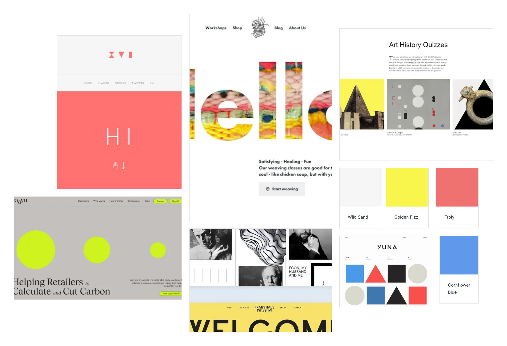

# The Art Aesthete Quiz

<!--[Am I responsive - Art Quiz](docs/XXX.png) -->

# Project Overview

Welcome,

This is The Art Aesthete Quiz website, an interactive quiz website for art enthusiasts. It is Rachel Luke's submission for Code Institue's Interactive Front End Design module.

The following are high-level details of this project:

- The main technologies used are HTML, CSS and JavaScript.
- The project demonstrates interactive front end web design.
- A top navigation bar and footer is established for structured layout.
- Git & GitHub are used for version control.
- Any external code sources used in the project are clearly identified in the code itself and in this README.md file
- The final version has been deployed via GitHub Pages. 

The last update to this file was: **May 25th, 2024**

# Table of Contents

- [The Art Aesthete Quiz](#the-art-aesthete-quiz)
- [Project Overview](#project-overview)
- [Table of Contents](#table-of-contents)
- [UX](#ux)
  - [User Goals](#user-goals)
  - [User Stories](#user-stories)
  - [Site Owners Goals](#site-owners-goals)
    - [Requirements](#requirements)
    - [Expectations](#expectations)
- [UI / Design Choices](#ui-design-choices)
  - [Moodboard](#moodboard)
  - [Fonts](#fonts)
  - [Icons](#icons)
  - [Colours](#colours)
  - [Media Queries](#media-queries)
  - [Wireframes](#wireframes)
- [Technologies used](#technologies-used)
  - [Languages](#languages)
  - [IDE](#ide)
  - [Libraries \& Framework](#libraries--framework)
  - [Tools](#tools)

# UX

## User Goals

1. Visually appealing, including images.
2. Easily navigated around.
3. Accessible information to understand how to play the quiz.
4. Exude an artistic aesthetic to fit the theme.
5. Available contact information.

## User Stories

1. As a user, I want to find this art quiz website aesthetic and appealing. 
2. As a user, I want to be able to choose the difficulty of the quiz.
3. As a user, I want to be able to easily navigate through the website.
4. As a user, I want to be able to know if my chosen quiz answers are correct.
5. As a user, I want to know what my current and final quiz scores are.

## Site Owners Goals

1. Promote art.
2. Increase the number of online foot traffic.
3. Increase rankings on search engines.

### Requirements

1. Easy to navigate on various screen sizes.
2. Clear information on what the website offers (a quiz game).
3. Functioning quiz game for users to interact with and delve into their hobby.
4. Simple methods of contacting the website owners.
5. Visually inviting so users engage longer on the website.
  
### Expectations

1. I expect to know if a quiz answer has been submitted properly and if it is correct.
2. I expect all links to social media sites to be opened in a new tab.
3. I expect all navigation links to work correctly.
4. I expect screen size not to affect the quality of the website.
5. I expect all information to be correct and accurate.

\
&nbsp;
[Back to Top](#table-of-contents)
\
&nbsp;

# UI / Design Choices

## Moodboard

One of the first milestones of this project was to create a moodboard to help envision the overall house style of the webiite and ensure that all of the sections and elements are cohesive. The software I used to create the moodboard for this website is [Mila Note](https://milanote.com/ "Mila Note").
Below, is the moodboard:

## Fonts

In order to move away from the basic fonts available, I have used
[Google Fonts](https://fonts.google.com/ "Google Fonts") to find a text that best suits the feel of the website. For the launch page title "Hello.", which is the very first element the users' attention is drawn to, I have chosen [Sofia Sans](https://fonts.google.com/specimen/Sofia+Sans "Sofia Sans font"). The background-fill of the text is a busy, vibrant image and this font was clear and easy to read. The main text I have chosen [Krub](https://fonts.google.com/specimen/krub "Krub font") as I feel it suits the contemporary art aesthetic and it is clear to read. To make the headers stand out, I decided to use [Oxygen](https://fonts.google.com/specimen/Oxygen?query=oxygen "Oxygen font"). This font is complimentary to the Krub font, and will help be distinctive as the main navigation link/ logo in the header. An additional font [Petrona](https://fonts.google.com/?query=petrona "Petrona font") is used to contrast against the modern, sans serif text. 

Additional Notes:

- I have intentionally imported the fonts in the css file and not index.html as it saved some space in the html file and as this is a static website, the slightly longer loading time is not critical.
  
- Backup fonts (sans-serif) have been put in place as a safety net, in case the custom fonts used are not available.

- There is a 'double reset' in the css file. It simplifies calculate rem unit as I no longer need to think in scale factor of 1.6 but 10 instead.

## Icons

I have incorporated icons for my website from the [Font Awesome library](https://fontawesome.com/ "Font Awesome"). These icons are used as the social media links in the footer and also in the subscribed.html file. All icons used are styled within the overall website theme.

## Colours

The colour scheme of the website is inspired by the moodboard (previously depicted). I have used [Coolers](https://coolors.co/ "coolers") to retrieve the desired colour codes and generate the colour palette.

Below, is the color palette:

## Media Queries

As a starting point, I have designed this website with a mobile first mindset using the iPhone 5/SE (320px) as the smallest screen size for styling to look good on. Then I created 3 additional media queries for largers devices listed below.

| Screen Size |  Breakpoint |
| ----------- | ----------- | 
| mobile      |  <320px     |
| tablet      |  => 768px   |
| laptop      |  => 1920px  |
| desktop     |  => 2560px  |

\
&nbsp;
[Back to Top](#table-of-contents)
\
&nbsp;

## Wireframes

I have used [Balsamiq](https://balsamiq.com/wireframes/ "Balsamiq") to develop my wireframes for my website. I initially created the mobile version and then the wireframes and then scaled it up for desktop. The website is a single page that is scrollable and displays/hides sections with logic in lieu of having multiple HTML pages to avoid inconvenient reloading of entire website.

The wireframes are below:

[Landing Page - Desktop Wireframe](docs/wireframes/launch-view-desktop.png "home desktop wireframe")

[Landing Page - Phone Wireframe](docs/wireframes/launch-view-mobile.png "home phone wireframe")

[Quiz Mode Section - Desktop Wireframe](docs/wireframes/quiz-mode-view-desktop.png "mode desktop wireframe")

[Quiz Mode Section - Phone Wireframe](docs/wireframes/quiz-mode-view-mobile.png "mode phone wireframe")

[Quiz Game Section - Desktop Wireframe](docs/wireframes/quiz-view-desktop.png "quiz desktop wireframe")

[Quiz Game Section - Phone Wireframe](docs/wireframes/quiz-view-mobile.png "quiz phone wireframe")

[Help Section - Desktop Wireframe](docs/wireframes/help-view-desktop.png "help desktop wireframe")

[Help Section - Phone Wireframe](docs/wireframes/help-view-mobile.png "help phone wireframe")

[Result Section - Desktop Wireframe](docs/wireframes/result-view-desktop.png "result desktop wireframe")

[Result Section - Phone Wireframe](docs/wireframes/result-view-mobile.png "result phone wireframe")

[Footer - Desktop Wireframe](docs/wireframes/footer-desktop.png "footer desktop wireframe")

[Footer - Phone Wireframe](docs/wireframes/footer-mobile.png "footer phone wireframe")

\
&nbsp;
[Back to Top](#table-of-contents)
\
&nbsp;

# Technologies used

## Languages

- [HTML](https://en.wikipedia.org/wiki/HTML "HTML")
  
- [CSS](https://en.wikipedia.org/wiki/CSS "CSS")

- [JavaScript](https://en.wikipedia.org/wiki/JavaScript "JavaScript")

## IDE

- [Codeanywhere](https://codeanywhere.com/ "Codeanywhere")

## Libraries & Framework

- [Google Fonts](https://fonts.google.com/ "Google Fonts")
  
- [Font Awesome library](https://fontawesome.com/ "Font Awesome")

## Tools

- [Mila Note](https://milanote.com/ "Mila Note")
  
- [Balsamiq](https://balsamiq.com/wireframes/ "Balsamiq")

- [CI Full Template](https://github.com/Code-Institute-Org/ci-full-template "CI Full Template")
  
- [Coolers](https://coolors.co/ "coolers")
  
<!-- - [Am I Responsive](https://ui.dev/amiresponsive "am i responsive") -->

<!-- 
- [W3C HTML Validation Service](https://validator.w3.org/ "W3C HTML")
  
- [W3C CSS Validation Service](https://jigsaw.w3.org/css-validator/ "W3C CSS")

TODO Add Java validation Service -->

\
&nbsp;
[Back to Top](#table-of-contents)
\
&nbsp;

# Deployment

This project was deployed using GitHub Pages through the following steps:

1. Navigated to the repository on github and click **Settings**.
2. Selected **Pages** on the side navigation.
3. Selected the **None** dropdown, and then clicking 'main'.
4. Clicked on the **Save** button.
5. Now the website was live on [The Art Aesthete Quiz Website](https://rachelcluke.github.io/art-aesthete-quiz/ "Art Aesthete Quiz")
6. If any changes were required, they could be done, commited and pushed to GitHub and the changes would be updated.

\
&nbsp;
[Back to Top](#table-of-contents)
\
&nbsp;